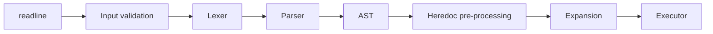

*This project has been created as part of the 42 curriculum by mosokina, aaladeok.*

# Minishell

## Description

Minishell is a small Unix shell modelled on **bash**, written from scratch in
C. The goal of the project is to learn how a shell really works: processes,
file descriptors, signals and parsing a command language. It has a lexer, a
recursive-descent parser that builds an abstract syntax tree (AST), and an
executor that runs pipelines, redirections, `&&`/`||` lists and subshells
using `fork`, `execve`, `pipe` and `dup2`.

Built as a pair project at [42 London](https://42london.com/). Both the
mandatory and the bonus parts are implemented (`&&`, `||`, parentheses and
`*` wildcards). The code follows the school's strict style rules (the
*Norm*).

### Features

| Area | Supported |
|---|---|
| **Commands** | Looks up `PATH`, accepts absolute and relative paths, returns bash's exit codes (`126`, `127`, `128+n` for signals) |
| **Pipelines** | Any number of commands joined by `\|` |
| **Redirections** | `<`, `>`, `>>`, `<<` (heredoc, with `$VAR` expansion unless the delimiter is quoted) |
| **Logical operators** | `&&` and `\|\|` with correct precedence |
| **Subshells** | `( ... )` for grouping, run in a child process |
| **Quoting** | `'single'` (literal) and `"double"` (expands `$`) quotes |
| **Expansion** | `$VAR`, `$?`, word splitting of unquoted results, quote removal |
| **Wildcards** | `*` globbing in the current directory, sorted alphabetically like bash |
| **Builtins** | `echo [-n]`, `cd`, `pwd`, `export`, `unset`, `env`, `exit` |
| **Signals** | `ctrl-C`, `ctrl-D` and `ctrl-\` behave like in bash. In interactive mode: `ctrl-C` displays a new prompt on a new line, `ctrl-D` exits the shell, `ctrl-\` does nothing |
| **Environment** | Keeps its own copy of the environment, increments `SHLVL`, updates `PWD`/`OLDPWD` |
| **History** | Command history through GNU readline |

### Architecture



1. **Input validation** (`srcs/input`) rejects syntax errors such as open
   quotes, bad operator combinations and unbalanced parentheses before any
   work is done. These return exit status `2`, as bash does.
2. **Lexer** (`srcs/tokenization`) splits the line into a linked list of
   tokens: words, operators, redirections and parentheses. Quoted sections
   stay together.
3. **Parser** (`srcs/binary_tree`) is a recursive-descent parser
   (`parse_expression → parse_term → parse_factor`) that builds an AST.
   Node types are `N_ANDIF`, `N_OR`, `N_PIPE`, `N_SUBSHELL` and `N_EXEC`.
   `|` binds more tightly than `&&` and `||`, and both group from left to
   right, so for

   ```sh
   cmd1 | cmd2 | cmd3 | (cmd4 | cmd5 || cmd6) | cmd7 && cmd8 | cmd9
   ```

   the parser builds this tree (pipes are numbered in the order they appear):

   ```mermaid
   flowchart TD
       AND["&&  (root)"] --> P5["| p5"]
       AND --> P6["| p6"]
       P5 --> P3["| p3"]
       P5 --> C7[cmd7]
       P3 --> P2["| p2"]
       P3 --> SUB["( ) subshell"]
       P2 --> P1["| p1"]
       P2 --> C3[cmd3]
       P1 --> C1[cmd1]
       P1 --> C2[cmd2]
       SUB --> OR["||"]
       OR --> P4["| p4"]
       OR --> C6[cmd6]
       P4 --> C4[cmd4]
       P4 --> C5[cmd5]
       P6 --> C8[cmd8]
       P6 --> C9[cmd9]
   ```

   The executor walks this tree from the root: it runs the left side of
   `&&` first and runs the right side only if the left side succeeds.

4. **Heredocs** (`srcs/heredoc`) are all read before execution starts, as in
   bash, and saved to temporary files that are deleted afterwards.
   `Ctrl-C` during a heredoc cancels the whole command line.
5. **Expansion** (`srcs/expansion`) runs just before each command, in bash's
   order: variables, then word splitting, then globbing, then quote removal.
6. **Executor** (`srcs/exec`) walks the tree. `&&`/`||` short-circuit on the
   exit status. Pipelines fork one child per command and connect them with
   pipes. Builtins run in the parent process when they are not part of a
   pipeline, so that `cd`, `export` and `exit` change the shell itself.

Other modules: `srcs/builtins`, `srcs/signals` (switching handlers between
interactive and execution mode, and hiding `^C` with termios `ECHOCTL`),
`srcs/shell_attributes` (the environment list and `PATH` lookup) and
`libft/` (our own C standard library functions).

## Instructions

### Requirements

- Linux or macOS
- `gcc`, `make`
- GNU readline
  - Debian/Ubuntu: `sudo apt install libreadline-dev`
  - macOS: `brew install readline` (the Makefile looks in `/opt/homebrew/opt/readline`)

### Build and run

```sh
git clone https://github.com/MariiaOsokina/Minishell.git
cd Minishell
make
./minishell
```

### Tests

```sh
make test    # starts minishell under valgrind to check for leaks and open file descriptors
make env     # same as test, but with an empty environment (env -i)
```

### Limitations

As required by the project, minishell does **not** support `;`, `\`, `&`
(background jobs), `$(...)` command substitution, arithmetic, or
variable assignment without `export`.

## Resources

- [GNU Bash Reference Manual](https://www.gnu.org/software/bash/manual/bash.html):
  the reference for all behaviour, especially *Shell Expansions* and
  *Redirections*
- [POSIX Shell Command Language](https://pubs.opengroup.org/onlinepubs/9699919799/utilities/V3_chap02.html):
  the formal grammar and order of expansions
- [GNU Readline Library](https://tiswww.case.edu/php/chet/readline/rltop.html)
- Linux man pages: `fork(2)`, `execve(2)`, `pipe(2)`, `dup2(2)`, `waitpid(2)`,
  `sigaction(2)`, `termios(3)`
- [Write a Shell in C](https://brennan.io/2015/01/16/write-a-shell-in-c/),
  Stephen Brennan: a short introduction to the read-parse-execute loop
- [Crafting Interpreters: Parsing Expressions](https://craftinginterpreters.com/parsing-expressions.html),
  Robert Nystrom: recursive-descent parsing and operator precedence


## Authors

- **Mariia Osokina** ([@MariiaOsokina](https://github.com/MariiaOsokina)):
  execution engine (pipes, redirections, subshells, logical operators),
  expansion (variables, word splitting, wildcards, quote removal), heredocs,
  builtins, signal handling, environment management
- **Adewale Aladeokin** ([@Lexymma](https://github.com/Lexymma)): lexer,
  AST parser, input validation, prompt and error reporting
